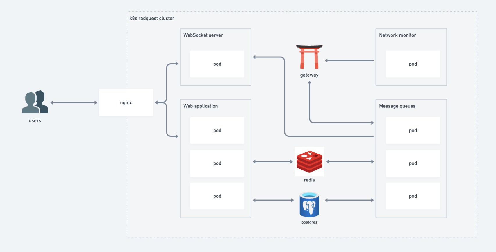

<h1 style="text-align: center;">RadQuest</h1>

## Development

### Pre-requisites

- node >=18
- npm@9.6.7
- [docker client](https://www.docker.com/get-started/)

```bash
# Install dependencies in project root folder
npm install
```

### Run frontend only

```bash
npm run dev:dapp
```

### Run the full-stack

```bash
# starts all services
docker compose up

# creates the required tables and schemas in database
# only needed if there are changes in the schema or in a newly cloned repo
npm run db:push

# builds commonjs version of database client
npm run db:build

# runs all applications in development mode
npm run dev
```

### Install dependency

```bash
# run in project root folder
npm install PACKAGE_NAME --workspace=NAME_OF_APP
```

### Update dependency

```bash
# run in project root folder
npm update PACKAGE_NAME --workspace=NAME_OF_APP
```

### Uninstall dependency

```bash
# run in project root folder
npm uninstall PACKAGE_NAME --workspace=NAME_OF_APP
```

## Architecture



### Folder structure

```bash
├── apps
    ├── dapp
    ├── notification
    ├── transaction-stream
    └── workers
```

### dApp

Frontend and public API.

### Notification

User notifications with real-time data.

### Transaction steam

Ingests and filters through a live stream of transactions on the Radix network.

### Workers

Processors of items in message queues.
