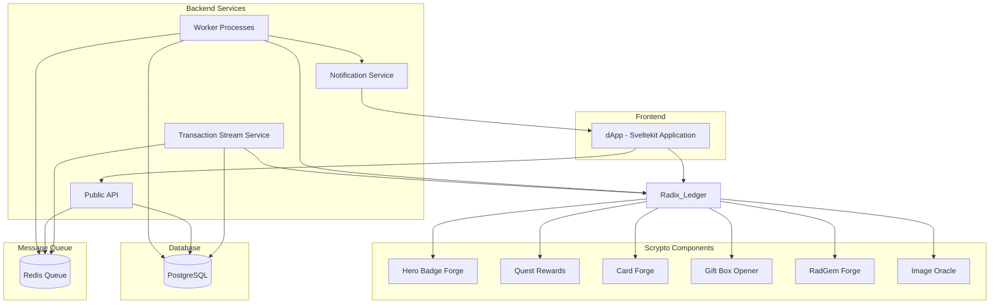
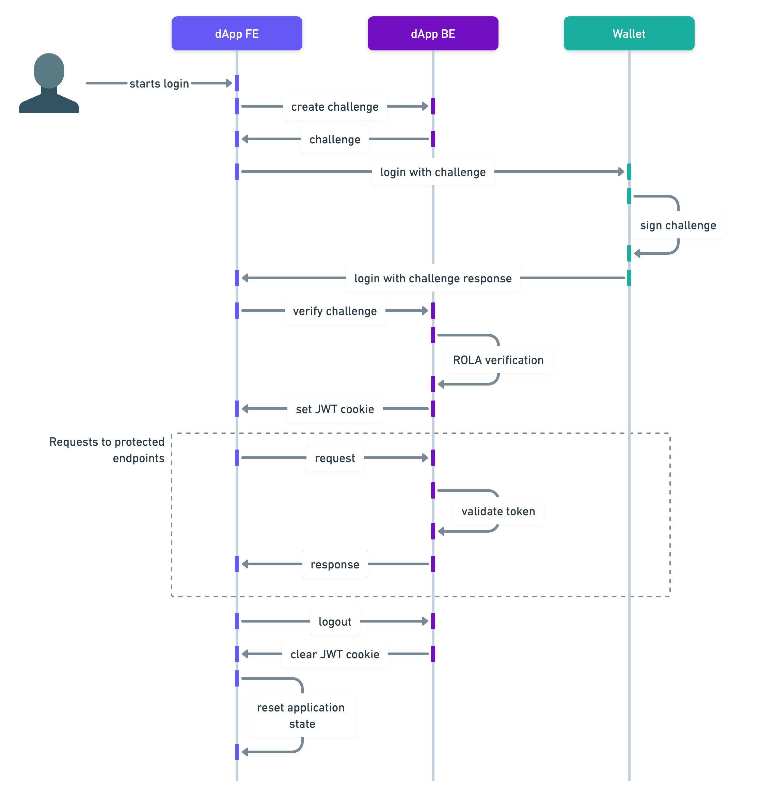

<h1 style="text-align: center;">Fullstack dApp Example</h1>

## Description
This repository contains source code for a stripped down version of RadQuest (radquest.io), an interactive onboarding platform for the Radix DeFi ecosystem. This codebase serves as a comprehensive example of building a full-stack decentralized application on Radix, featuring:
- Multiple Scrypto components for on-chain functionality
- A Svelte-based frontend application
- Backend services for transaction monitoring and notifications
- Database integration and worker processes
- Docker-based development environment
Whether you’re studying the implementation, or learning how to build on Radix, this repository demonstrates real-world patterns and practices for dApp development.

The architecture consists of several key components:
1. **Frontend**
   - Svelte-based dApp interface
   - Connects to backend API and Radix network
2. **Backend Services**
   - Public API for frontend interactions
   - Transaction Stream service for monitoring blockchain events
   - Notification service for user alerts
   - Worker processes for async task processing
3. **Storage**
   - PostgreSQL database for application data
   - Redis for message queuing
4. **Radix Components**
   - Multiple Scrypto packages for different functionalities
   - Image Oracle for verifying NFT images
   - Various forge components for badge and item creation
Each application is containerized using Docker for consistent development and deployment environments.



## Development

### Pre-requisites

- node >=18
- npm@9.6.7
- [docker client](https://www.docker.com/get-started/)

```bash
# Install dependencies in project root folder
npm install
```

### Build scrypto packages

```
cd scrypto-packages/radquest
scrypto build

cd scrypto-packages/hero-badge-forge-v2
scrypto build

cd scrypto-packages/quest-rewards-v2
scrypto build

cd scrypto-packages/card-forge-v2
scrypto build

cd scrypto-packages/gift-box-opener-v2
scrypto build

cd scrypto-packages/radgem-forge-v2
scrypto build
```

## Create accounts and deploy account controllers

Follow the steps in [/bootstrap-accounts](bootstrap accounts)

You should have generated a `secrets-accounts.json` and a `controller-accounts.json` file.

Copy the `access_controller_account` addresses of `owner`, `dAppDefinition`, `payer` and `system` from the resulting `controller-accounts.json` into the `packages/common/src/constants.ts` file, to the `address` fields.

Then, copy the `access_controller` values from `controller-accounts.json` and put them in the respective `accessController` fields in `packages/common/src/constants.ts`.

Then copy the mnemonics from the `secrets-accounts.json` file into the `.env` file.


### Deploy scrypto components to Stokenet

```bash
npm run wallet:create:resources
npm run wallet:deploy-new:all
npm run wallet:set:dapp-data
```

### Populate image oracle

```bash
npm run wallet:populate:oracle
```

### Add key value store address

Copy the `radgemForgeV2` address in `constants.ts`. Go to https://stokenet-dashboard.radixdlt.com/ and put it in the search bar, then open the `internal state` tab and copy the address of the `radgem_records` key value store and put it in `radgemRecordsV2KeyValueStore` in `constants.ts`.

### Run frontend only

```bash
npm run dev:dapp
```

### Run the full-stack

```bash
# starts all services
docker compose up -d

# creates the required tables and schemas in database
# only needed if there are changes in the schema or in a newly cloned repo
npm run db:push

# builds commonjs version of database client
npm run db:build

# runs all applications in development mode
npm run dev
```

### Install dependency

```bash
# run in project root folder
npm install PACKAGE_NAME --workspace=NAME_OF_APP
```

### Update dependency

```bash
# run in project root folder
npm update PACKAGE_NAME --workspace=NAME_OF_APP
```

### Uninstall dependency

```bash
# run in project root folder
npm uninstall PACKAGE_NAME --workspace=NAME_OF_APP
```

## User authentication



### Folder structure

```bash
├── apps
    ├── dapp
    ├── notification
    ├── transaction-stream
    └── workers
```

### dApp

Frontend and public API.

### Transaction steam

Ingests and filters through a live stream of transactions on the Radix network.

### Workers

Processors of items in message queues.